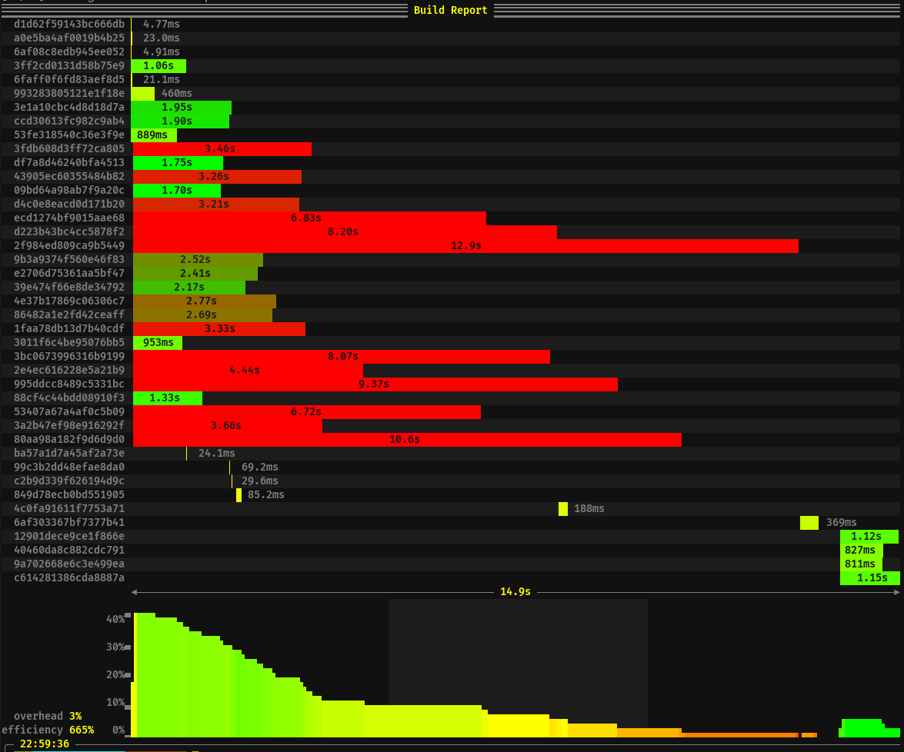

build-tools
===========

This is just a collection of tools which can be used in projects using `cmake` or
`make`/`ninja` directly to analyze the build process.  Specifically, the execution of
the invoked programs is tracked and then shown mapped to the total time of the
build process.



This screenshot shows the build of a small project.  `cmake` was instructed to use
`ninja` and on this occasion just three files had to be recompiled.  After that an
archive had to be updated before it and other files could be used to build a binary.

The names of the targets of each recorded build step is shown on the lefthand side.
The rest of the line is filled with the execution invocation.  The bars representing
the time times of the respective program runs start and end at the appropriate times
along the linear time axis.  Each bar has the time it took recorded.  The color is
representing how long, in relation to all the times when a program was executed, that
specific program ran, ranging from green (very little) to red (all the time).

At the bottom three summary numbers are presented:
- total time (obvious)
- the overhead of the build tool (i.e., how much of the total time was no program
  recorded being executed)
- the efficiency of the build using parallelism (i.e., how much of the total time
  do two program runs overlap)

The correctness of the measure of overhead depends on the recording being complete.
The instrumention of the programs run during the buid process does not happen
automatically and gaps in the recording could (but not necessarily do) mean that
something is not recorded.

If the project uses Cmake but is not configured yet, the script will run `cmake`, set up
the build directory, and then continue to build the project.  The build directory will
be `build` in the current directory.  If a directory with that name exists but is not
at all or incompletely configured as a build directory, nothing will be done.


What to do
----------

A `CMakeLists.txt` file needs to be prepared as follows:

- define the variable `CMAKE_<lang>_COMPILER_LAUNCHER` and `CMAKE_<lang>_LINKER_LAUNCHER` to
  `${CMAKE_SOURCE_DIR}/build-tools/launcher.sh`.
- define `CMAKE_AR` to `${CMAKE_SOURCE_DIR}/build-tools/launcher-ar.sh`.

Replace `build-tools` with the name of the directory the scripts can be found in.

This could like this:

```cmake
set(CMAKE_CXX_COMPILER_LAUNCHER ${CMAKE_SOURCE_DIR}/build-tools/launcher.sh)
set(CMAKE_CXX_LINKER_LAUNCHER ${CMAKE_SOURCE_DIR}/build-tools/launcher.sh)
set(CMAKE_C_COMPILER_LAUNCHER ${CMAKE_SOURCE_DIR}/build-tools/launcher.sh)
set(CMAKE_C_LINKER_LAUNCHER ${CMAKE_SOURCE_DIR}/build-tools/launcher.sh)
set(CMAKE_AR ${CMAKE_SOURCE_DIR}/build-tools/launcher-ar.sh)
```


Caveats
-------

It might be necessary to collect more information then the launchers allow to capture.
The scripts automatically determine the name of the output file for the build step
and this cannot be handled in a general way.  Hence there are already two scripts:
the `launcher.sh` script searches for the name after a `-o` parameter while
`launcher-ar.sh` takes the second parameters as the target name.
